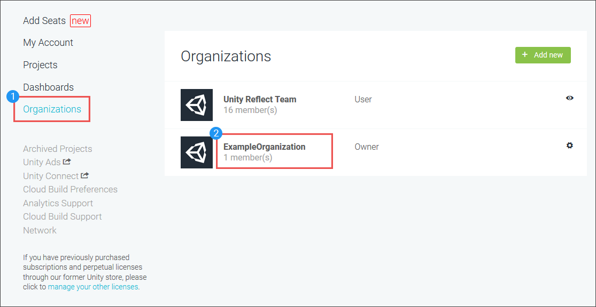
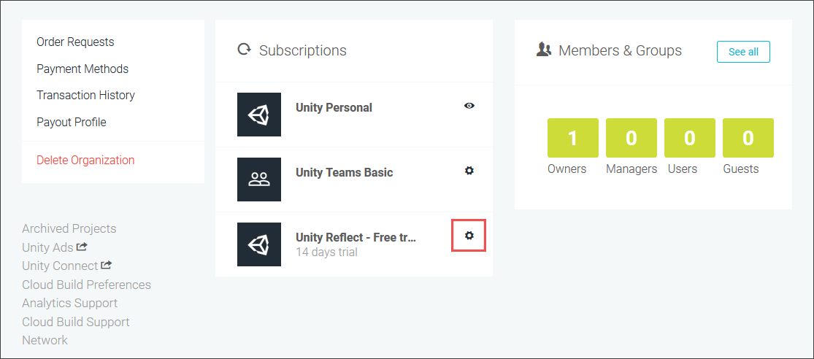
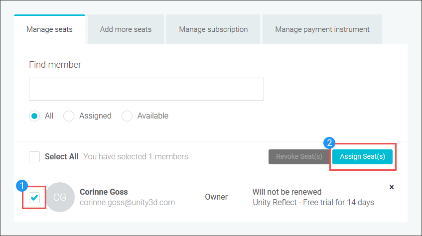

# Managing Reflect seats

Your organization must have Reflect seats available for you to assign seats to users.

## Assigning seats to users

1. Go to https://id.unity.com/ and select Organizations.

   

2. Click the name of the organization with unassigned seats.

3. In the **Subscription** section, click the gear icon next to Unity Reflect.  

   

4. Verify that you've selected the correct user, subscription, and organization and then click **Assign Seat(s).**

   

   The end user receives an email invitation.
