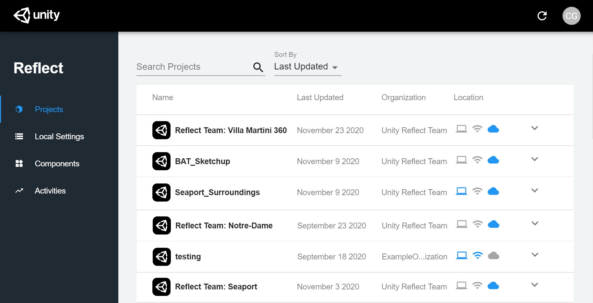
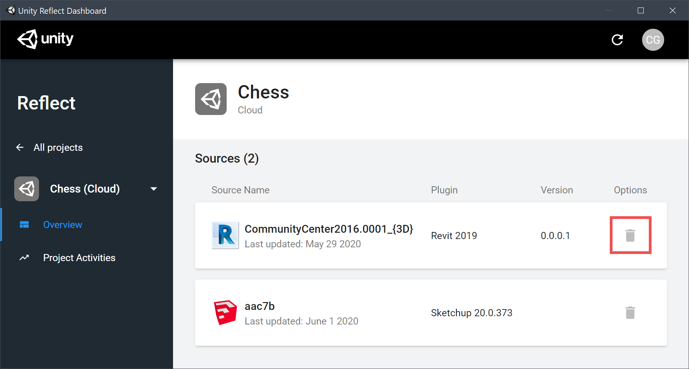
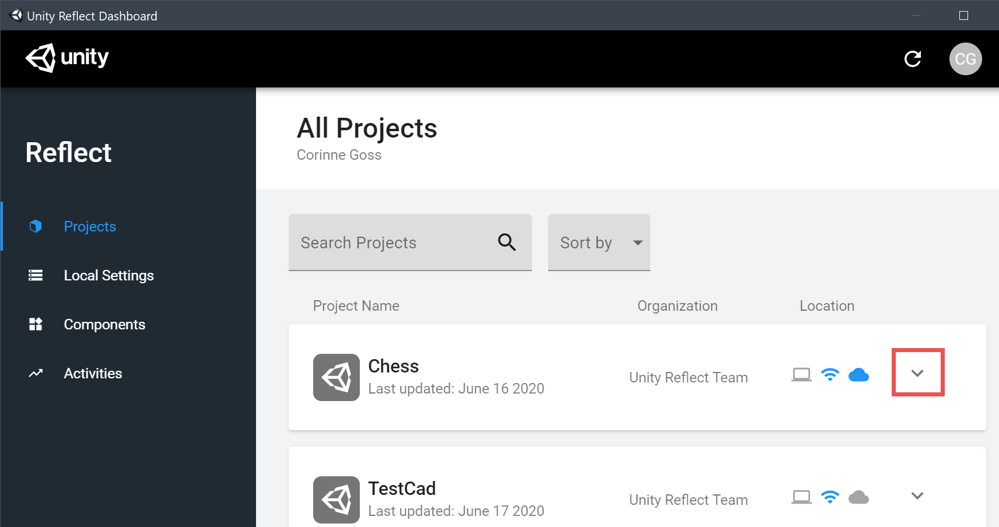
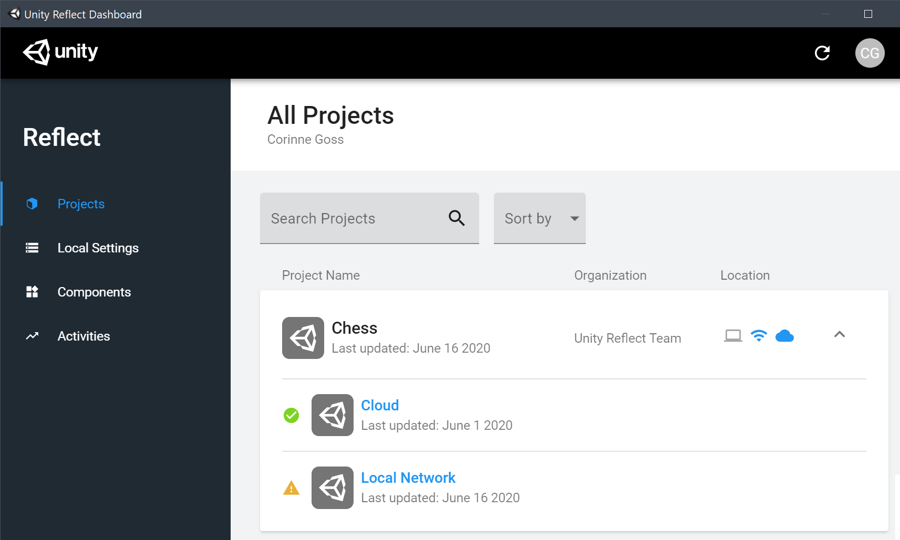
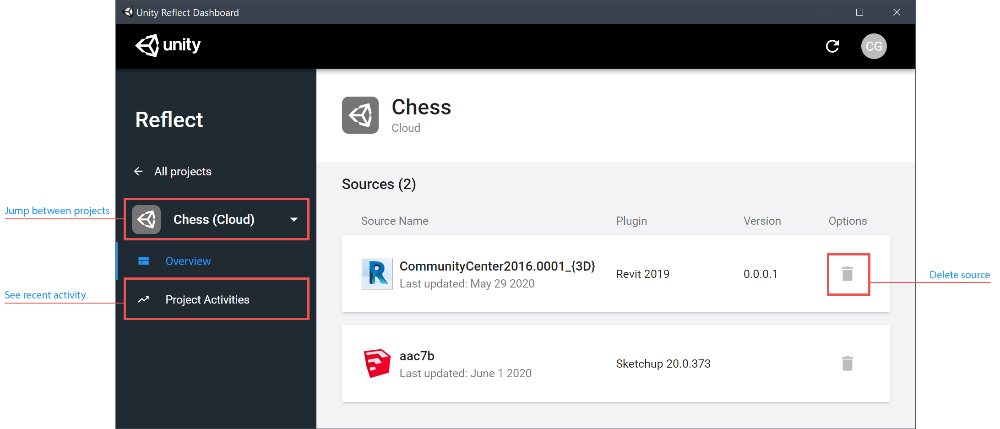

## Managing your storage in Reflect

The Unity Reflect Dashboard lets you manage where your projects are stored.

The **Projects** tab displays your projects in a list:

The list includes icons indicate where each project is currently stored: locally (), on a local network (), or in the cloud ().

<!--## Local storage

To open a project, click its name.
 (local, local network, or cloud)

Click the down arrow  to expand project details.

The list of linked sources is displayed:

To see further details on a source, click on its name.

To delete a source, click .## Network storage
 -->

## Cloud storage

Reflect gives you the option to host your projects in the cloud, letting you push data to your mobile devices even when you're on a different network.

**What data is sent to the cloud when doing an export?**

* If you export to a local or network server, no model data is sent over the internet.

* If you export to the cloud, then the input file is processed locally and derivative model data (geometry, materials, etc.) is sent to Unity.

* Project names are always sent over the internet to Unity.
