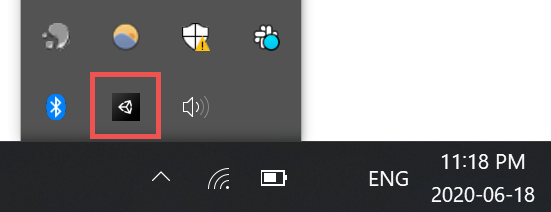
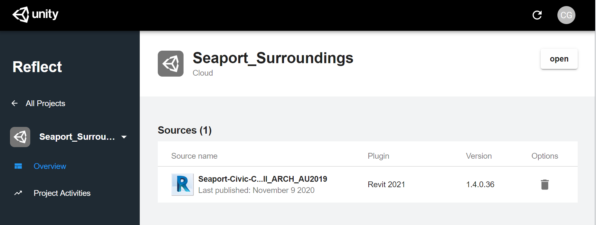
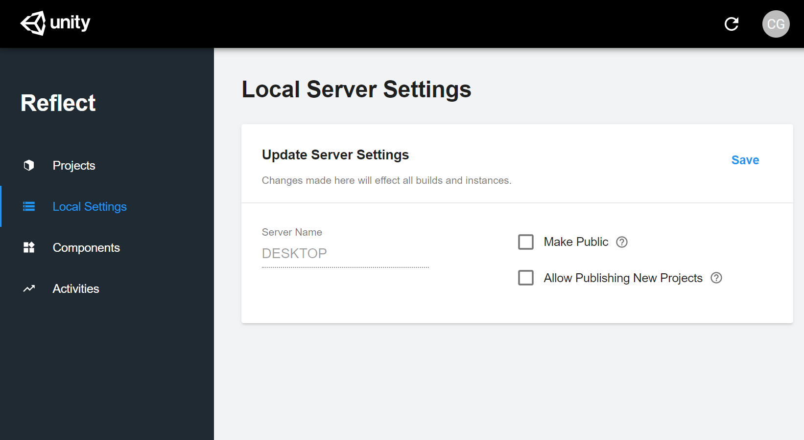
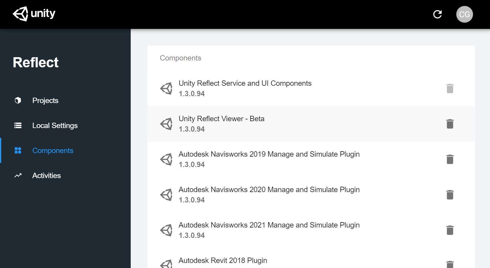
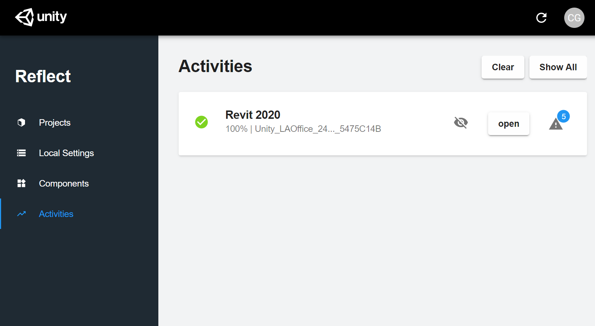
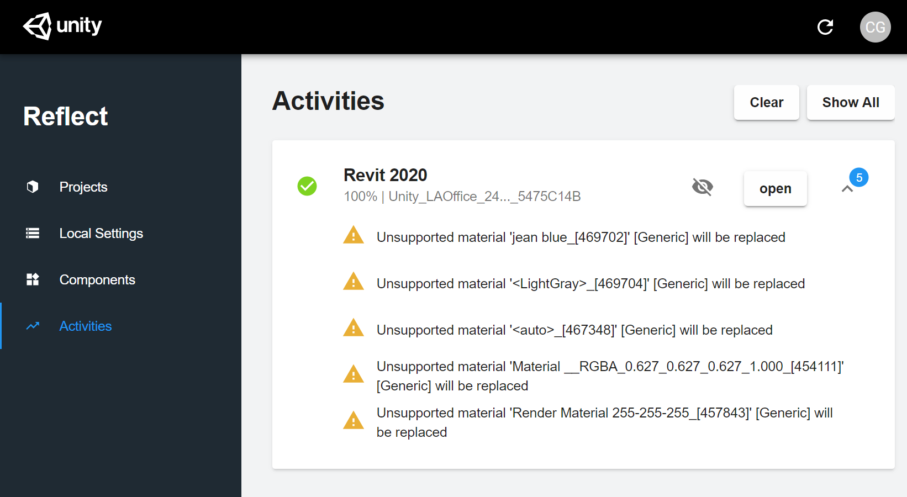

# Unity Reflect Dashboard

<!--(UPDATE IN PROGRESS. Breaking this into multiple docs and expanding, adding system tray options, etc.)-->

The Unity Reflect dashboard is a standalone application that lets you manage your projects, local server settings, installed Reflect components, and recent activity log.

## Opening the dashboard

To open the standalone Unity Reflect dashboard, click the Unity Reflect icon in your system tray:

You can also open the Unity Reflect Dashboard from the Start menu.

## Managing your projects

The Unity Reflect Dashboard lets you manage where your projects are stored.

The **Projects** tab displays your projects in a list:

The list includes icons indicate where each project is currently stored: locally (), on a local network (), or in the cloud ().

Click the down arrow  see all the instances of the project in its linked sources.

Click the name of a source to see additional details.

* To delete a project instance from a linked source, click .
* To see a log of recent activity for this project, click **Project Activities** in the left sidebar.

## Managing your server settings

The **Local Settings** tab lets you update the settings of your local sync server.

* **Make Public** makes your local server public to users that have access to the projects it contains.
* **Allow Publishing New Projects** allows users to publish new projects to this server. If unchecked, users can only publish to projects already present on this server.

Be sure to click **Save** after making any changes.

## Managing installed components

The **Components** tab shows a list of all Reflect components installed on your computer.

If you want to uninstall a particular component, click  and then click **Uninstall.**

## Accessing your activity log

The **Activities** tab shows a log of your recent Reflect activity.

To resume an activity, click **open**.

To expand any alerts associated with an activity, click .

To hide an activity in the log, click . To hide all activities, click **Clear**.

To reveal hidden activities, click **Show All**.
