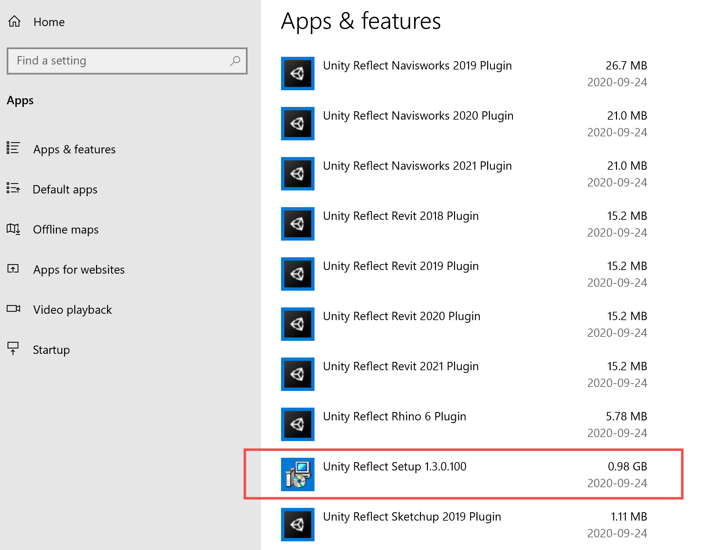
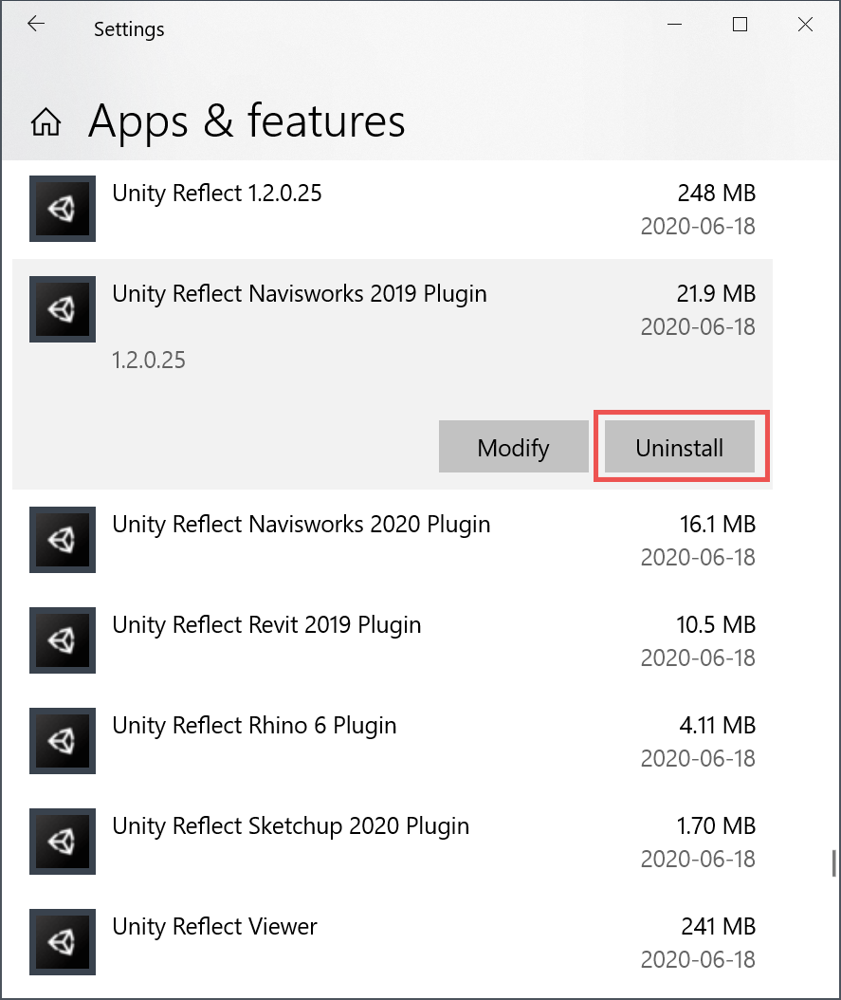

# Installing and uninstalling Reflect

## Installing Reflect

### Windows

 > **Note:** This may require administrator privileges.

To install Unity Reflect on Windows:

1. Download and open the installer from the [link](https://downloads.reflect.unity3d.com/stable/ReflectInstaller.exe) that you received upon purchase.

2. Select any optional components and click **Install**.

 

2. Click **Install**.

3. When the installation is complete, confirm that your desired components are installed and click **Finish**.

 

#### Reflect Viewer only

[Download](https://downloads.reflect.unity3d.com/stable/ReflectViewer.msi) and open the .msi file.

### iOS and Android

For mobile devices, the Unity Reflect Viewer is available in the [Apple App Store](https://apps.apple.com/us/app/unity-reflect/id1466287906) and on [Google Play](https://play.google.com/store/apps/details?id=com.Unity.Reflect.Viewer&hl=en_CA&gl=US).

## Uninstalling Reflect

You can manage your installation of Unity Reflect from **Windows Settings** > **Add or remove programs**.

* To uninstall Unity Reflect and all of its components, click **Unity Reflect Setup** > **Uninstall**.

  

* To uninstall specific components, click the name of the component > **Uninstall**.

  
