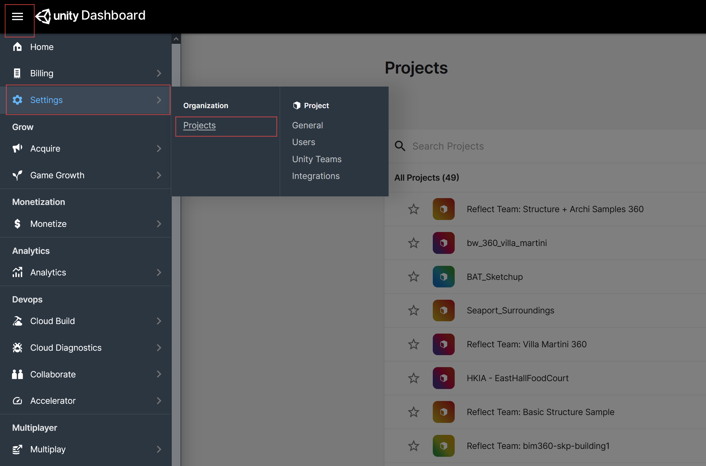
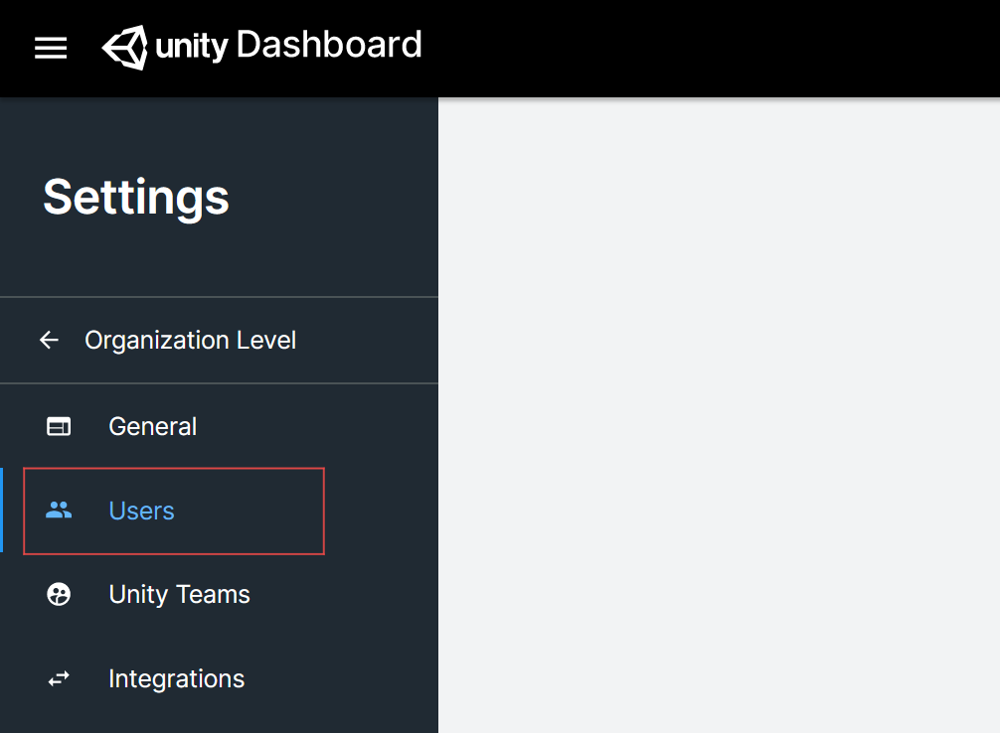
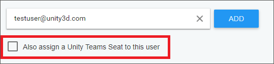

# Managing project permissions

By default, only you have permission to see and push data to your projects. To invite others to collaborate on a project, add them through Unity’s developer portal:

1. Log in to https://dashboard.unity3d.com/ and navigate to **Settings** > **Projects**.

   

2. Select your project.
3. In the left navigation bar, select **Users**.

   

4. Enter the email address of the person you want to invite and click **Add**.

   

<!--
5. By default, Unity will assign a Unity Teams seat to users you invite. If you do not want to assign them a seat, deselect this option:

   

    If the users you invite will use Reflect with the Unity Editor, they must be assigned a Unity Pro license.

6. Click **Add**.
-->
