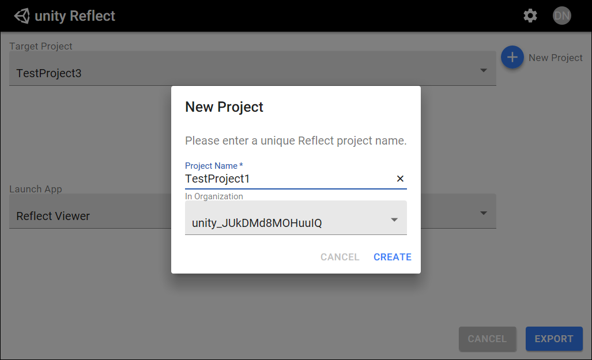

# Creating a project in Reflect WIP

Reflect offers a new way to manage your projects. This system leverages Unity’s existing Organization & Project structure.

To create a new project in Reflect:

1. Open Unity Reflect and click **New Project.**
2. Enter a project name and click **Create.**

   
