# Using the Reflect Viewer

This page provides an overview of the default Unity Reflect Viewer.

## Opening a project

The Viewer opens to the Projects screen by default.

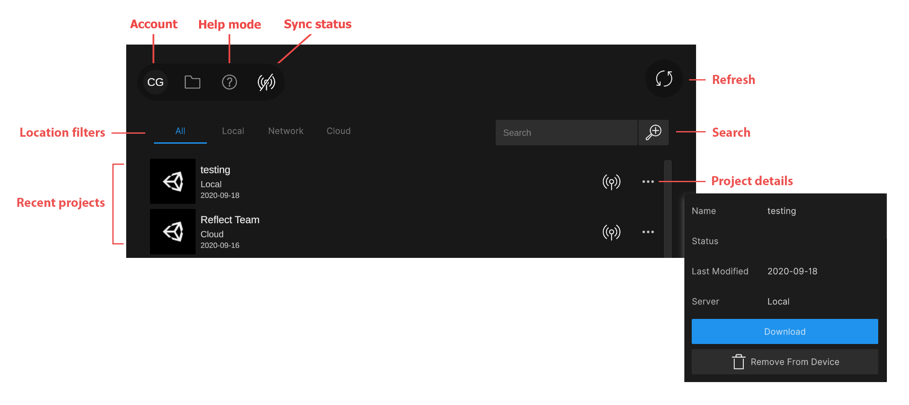

To refresh the list of projects, click the **Refresh** button () in the top right corner of the screen.

To open a project, click its name in the projects list.

For more information about the options on the Projects screen and how Reflect projects are stored and synced, see [Managing your storage](ManagingStorage.md).

## The Viewer interface

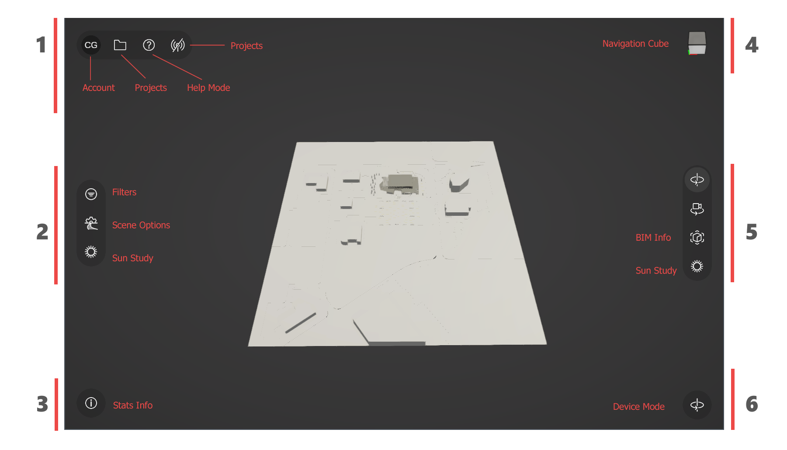

### 1. Main menu

The main menu is located in the top left corner of the Viewer.

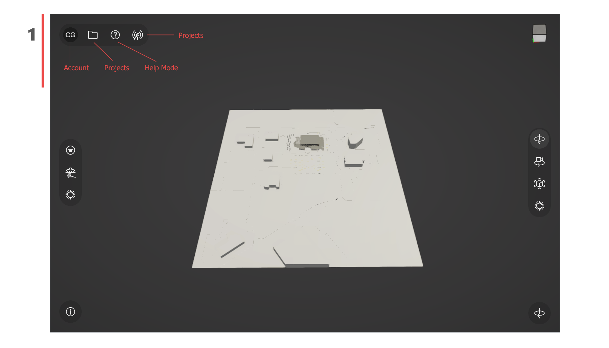

#### Logging in or out

To log in or out or to access the BIM 360 Dashboard, click the **Account** icon.

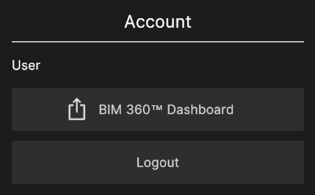

#### Opening the Projects screen

To open the Projects screen, click the **Projects** icon.

<!---->

#### Enabling Help Mode

For assistance with the Viewer tools, click the **Help Mode** icon.

To return to the Viewer, click the **Help Mode** icon again.

#### Turning the sync service on or off

Click the **Sync status** icon to turn the sync service on or off.

<!---->

When the service is **active**, the icon looks like this: 

When the service is **inactive**, the icon looks like this: 

### 2. Scene settings

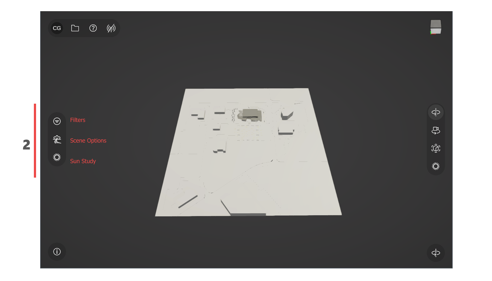

#### Filtering BIM visibility

Click the **Filters** button () to toggle the visibility of BIM data.

* Tap the eye icon next to each filter to turn it on or off.
* To see a different group of filters, click **Category** and select a category from the drop-down menu.

#### Toggling texture and light data

Click the **Scene Options** button () to turn texture and light data on or off.

#### Adjusting the position of the sun

The **Sun Study** buttons () let you adjust the position of the sun based on a specific time, date, and location.

**Entering specific values**

The Sun Study button on the left-hand side of the screen lets you adjust the position of the sun by entering specific values.

You can control any of the following parameters:

| Parameter | Description |
| -- | -- |
| Time of Day | The time of day in 24-hour format. |
| Time of Year | The day and month of the year. |
| UTC Offset | The time difference from UTC in hours and minutes.  |
| Latitude  | Latitude of the desired location. (0 degrees is the equator, 90 degrees is the North Pole, and -90 degrees is the South Pole.) |
| Longitude  | Longitude of the desired location. (0 degrees is Greenwich, with positive values to the east and negative values to the west.) |
| North Angle  | The direction of north in degrees. |

**Using the radial menu**

The Sun Study button on the right-hand side of the screen lets you adjust the position of the sun by rotating the radial menu.

Click  to switch to the date and time dials. The outer dial sets the date in months and the inner dial sets the time of day in 24-hour format.

Click
 to switch to the coordinate dials. The outer dial sets the solar azimuth and the inner dial sets the solar altitude. These coordinates are translated into the directional light’s rotation.

Click
to reset the dials to their starting position.

### 3. Stats menu

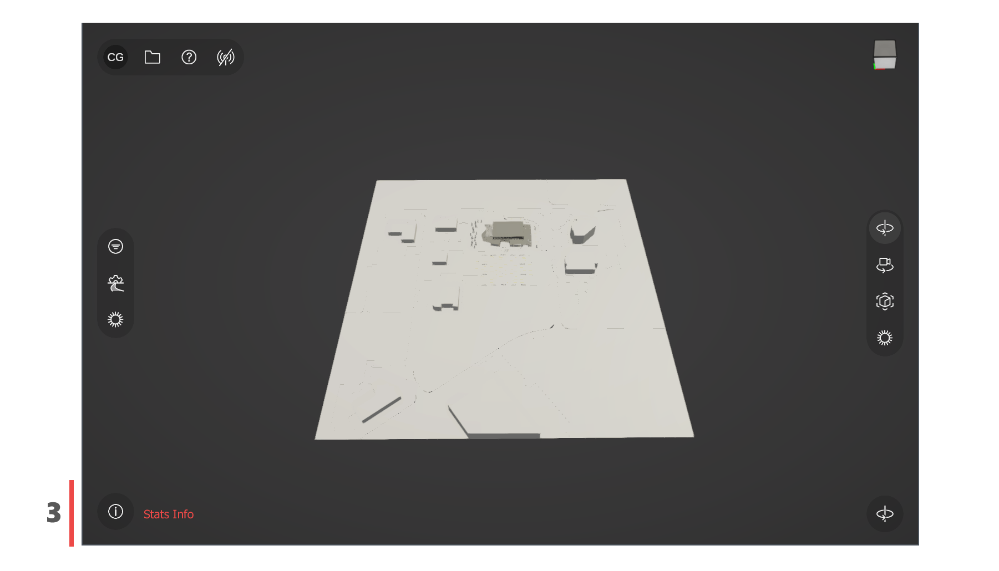

#### Showing the Stats Info menu

To display statistics about your scene, click the **Stats Info** button:

### 4. Navigation cube

Click the navigation cube for easy access to left, right, and top views of your model.

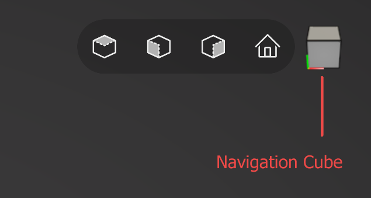

Click the house icon to return to the default view.

### 5. Contextual menu

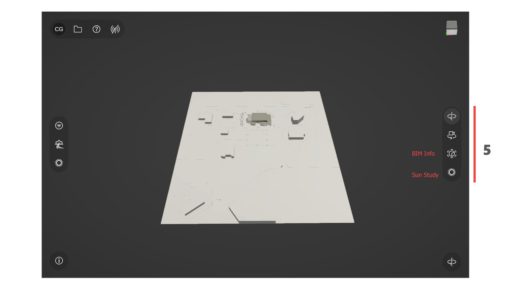

The Reflect Viewer lets you move, orbit, or zoom around your scene. The currently selected navigation control is shown in the right-hand menu.

#### Move (Pan) 

To move the camera from your current position, use the WASD keys to move left/right/forward/backward and the Q and E keys to move up and down.

You can also pan the camera freely by clicking and dragging with the middle mouse button or by holding the Alt key while you click and drag.

#### Orbit 

To rotate the view around your current position, right-click and drag inside the Viewer.

#### Zoom 

Use your scroll wheel to zoom in and out. You can also double-click a point inside the Viewer to jump there quickly.

#### Seeing BIM information about a particular object

Click the **BIM Info** button () and click on an object in your scene to highlight it and display its metadata.

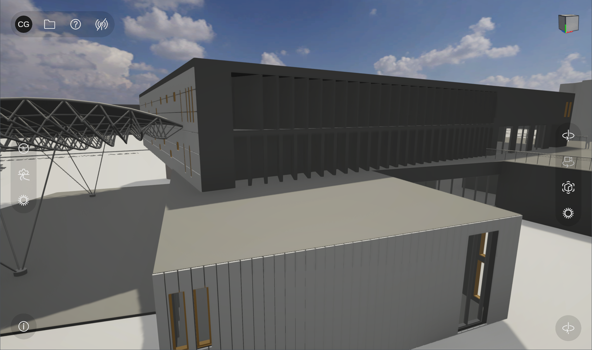

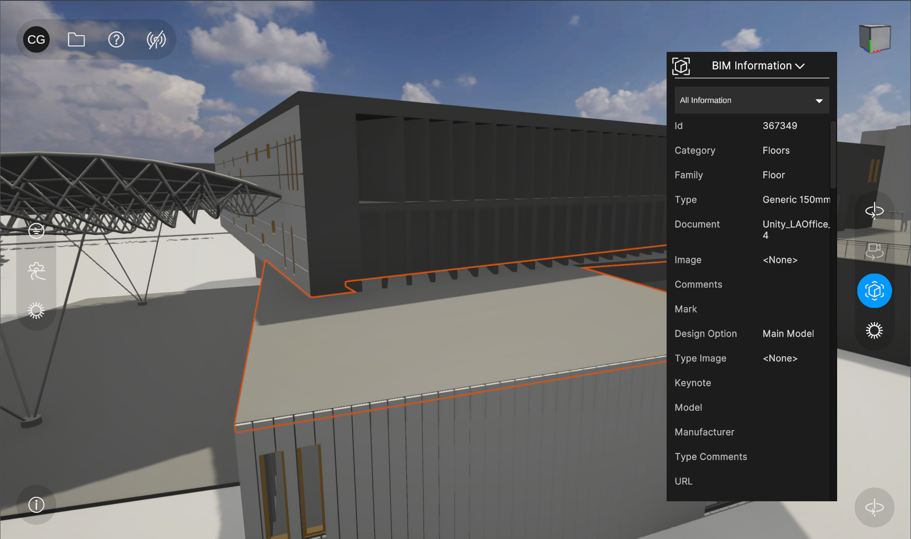

To switch between metadata categories, click the down arrow:

### 6. Device menu

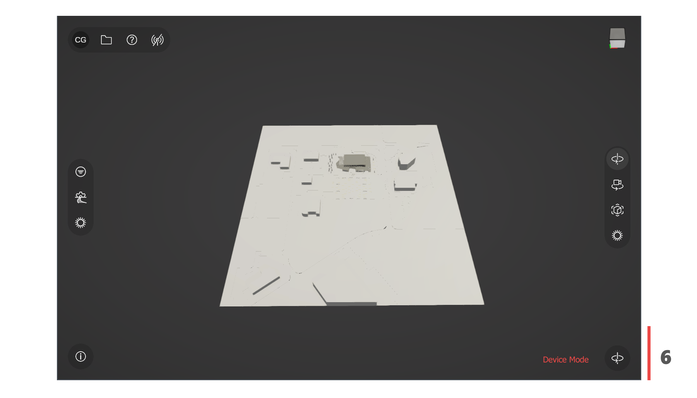

The button in the lower right corner of the Viewer displays the current device mode. Click this button to expand or collapse the device mode menu.

#### Enabling VR or AR mode

Click one of the device mode buttons to switch to the corresponding device mode. For more information, see:

* [Viewer AR](ViewerAR.md)
* [Viewer VR](ViewerAR.md)
