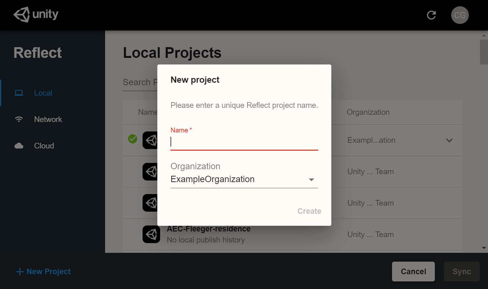
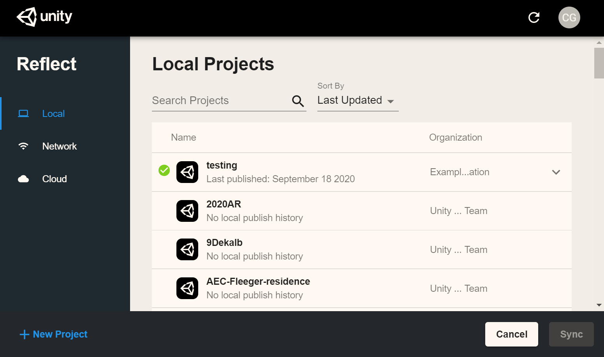
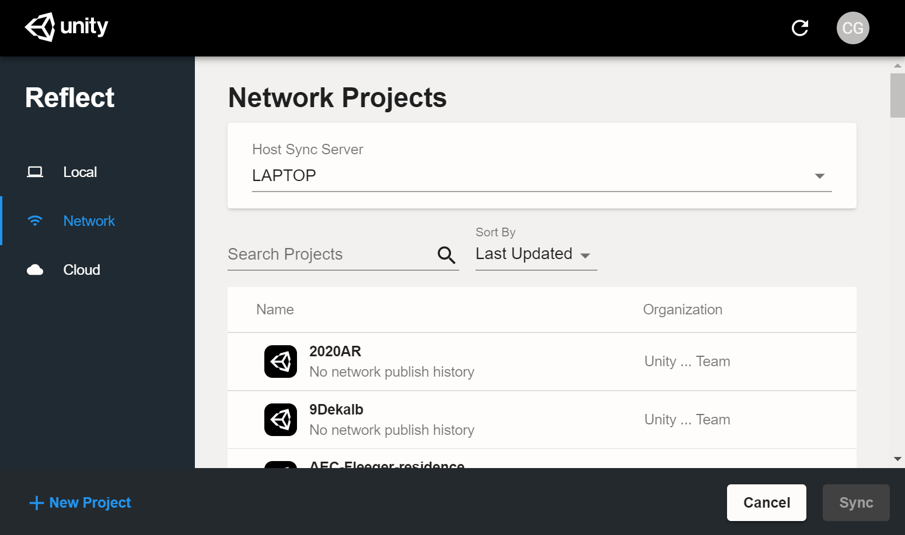
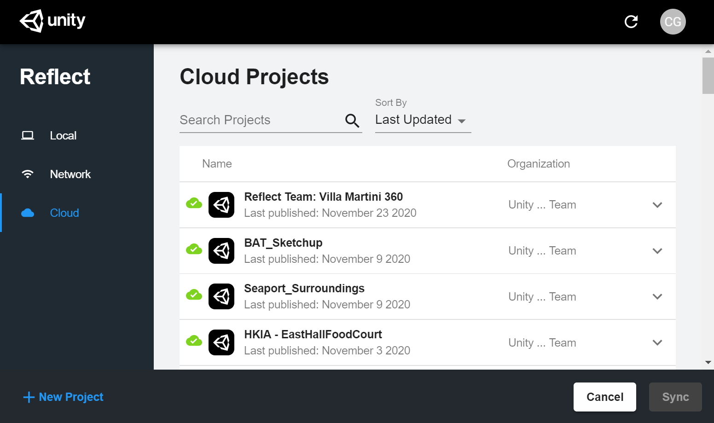

# Syncing and exporting

Reflect offers multiple storage locations for your projects.

To create a new Reflect project, click **New Project** in the bottom left corner of the window.

## Local

You can publish data to a project on your local computer:

## Network

You can publish data to a local network:

Click the drop-down menu to select your desired sync server.

For more information about configuring a local network, see [Network Configuration](NetworkConfiguration.md).

## Cloud

Reflect also gives you the option to host your projects in the cloud, letting you push data to your mobile devices even when you're on a different network.

**What data is sent to the cloud when doing an export?**

* If you export to a local or network server, no model data is sent over the internet.

* If you export to the cloud, then the input file is processed locally and derivative model data (geometry, materials, etc.) is sent to Unity.

* Project names are always sent over the internet to Unity.
