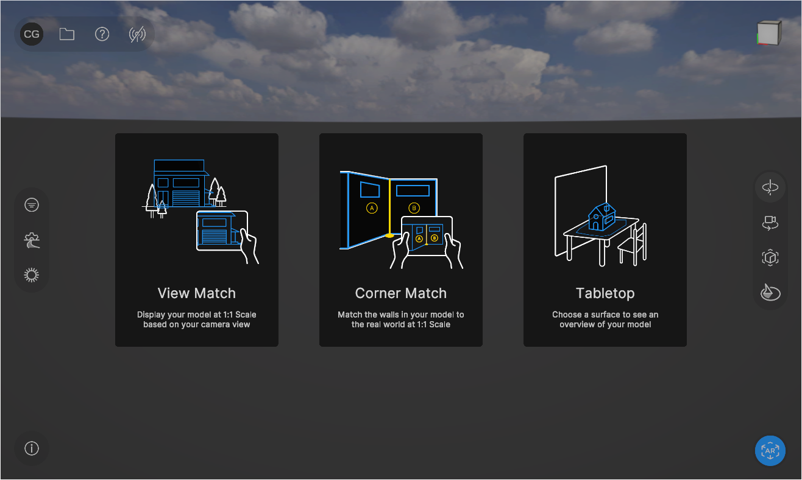
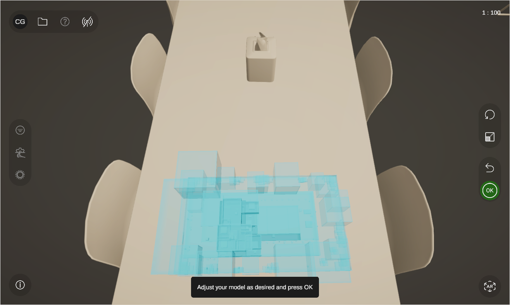
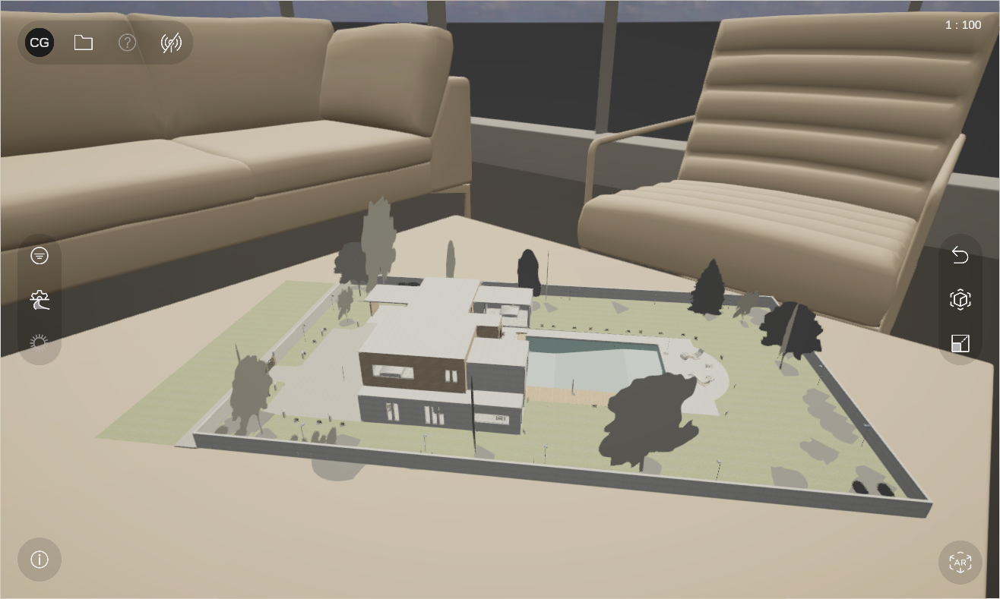

# AR modes in the Reflect Viewer

The Reflect Viewer for iOS and Android devices offers the ability to view your models in AR.

<!--
> **Note:** On desktop, you can enable AR in a simulated view using Project MARS. For more information about configuring the simulation, see the [Unity MARS documentation](https://docs.unity3d.com/Packages/com.unity.mars@1.2/manual/GettingStarted.html#setting-up-the-mars-device-and-simulation-views).
-->

To enable AR mode in the Viewer:

1. Tap  the button in the lower right corner of the Reflect Viewer to expand the device mode menu.

  

2. Tap the AR button.

You can now select your AR mode of choice.

## AR modes

### View Match

This mode displays your model at 1:1 scale based on your camera view.

To set up View Match:

1. Tap the **View Match** tile.

2. Follow the instructions on screen to match your model to your environment.

### Corner Match

This mode matches the walls in your model to the real world at 1:1 scale.

To set up Corner Match:

1. Tap the **Corner Match** tile.

2. Follow the instructions on screen to match your model to your environment.

### Tabletop AR

This mode lets you display your model on a surface.

To set up Tabletop AR:

1. Open a model in the Viewer, enable AR, and tap the **Tabletop AR** tile.

2. Move your device back and forth to find a horizontal surface. Tap OK.

3. Use the contextual menu on the right-hand side of the screen to rotate and scale the model to your satisfaction.

  

  Tap OK.

  
