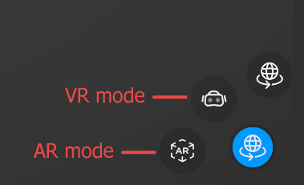
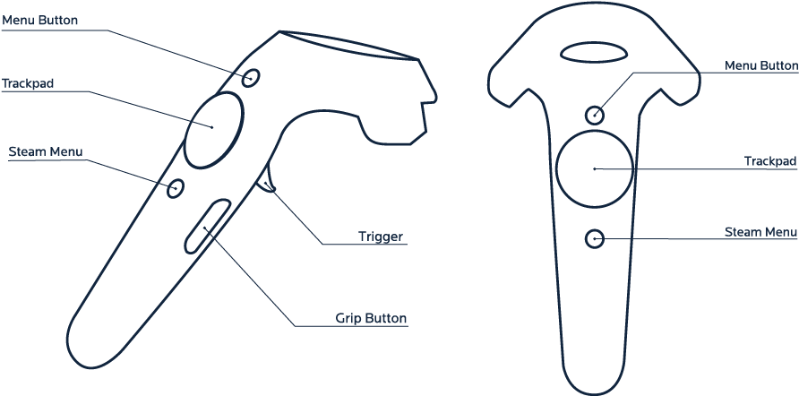

# VR mode in the Reflect Viewer

## Enabling VR

> **Note:** You can only enable VR if your Unity Project is set up for a VR headset. Unity Reflect currently supports the HTC Vive and Oculus Rift. For more information, see [the Unity Manual](https://docs.unity3d.com/Manual/xr-template-vr.html).
To enable VR mode in the Viewer:

1. Click the button in the lower right corner of the Viewer to expand the device mode menu.

  

2. Click the VR button.

## Using VR

### HTC Vive controls

* **Teleport**: Use the right trackpad to display the teleport beam and select a location and use the right trigger to teleport.
* **Fly**: Use the left trackpad.

### Oculus Rift controls

* **Teleport**: A + right trigger
* **Fly**: X
* **Turn 45 degrees**: Right thumbstick
* **Interact with UI**: Triggers
