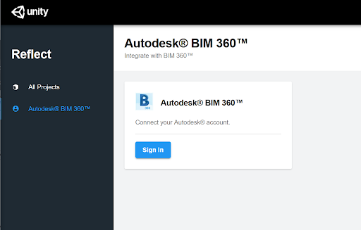
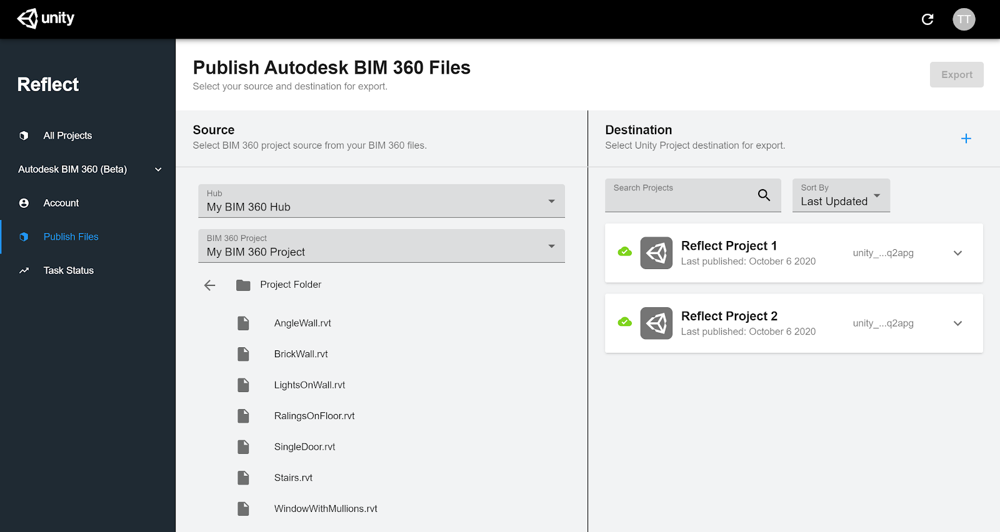
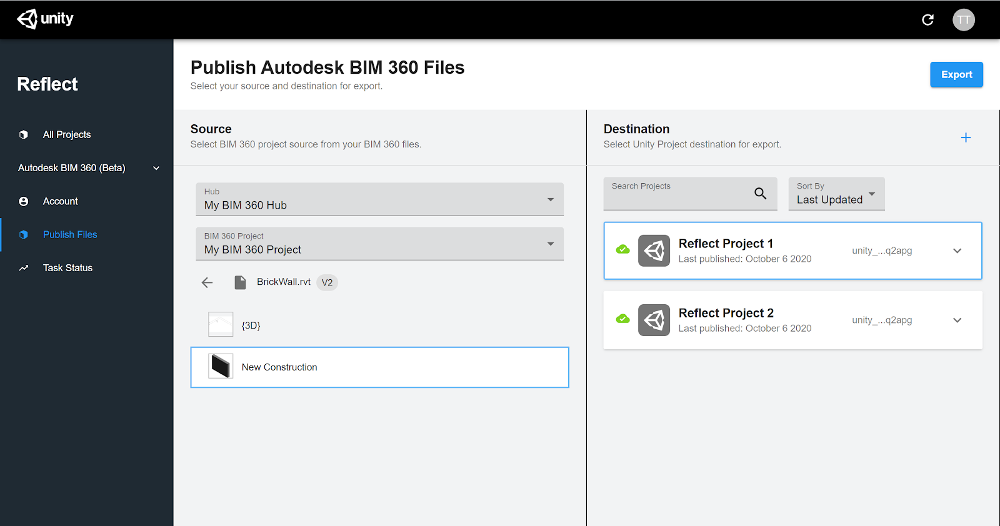

# The BIM 360 plugin for Reflect

## Authorizing the plugin

## Getting started

The app allows Unity Reflect to access your Autodesk BIM 360 files. Before you can install the plugin, you need to link Unity Reflect to your Autodesk BIM 360 account.

> **Note:** You must be a BIM 360 account administrator to continue.

1. Go to the Account Admin page (https://apps.b360.autodesk.com/)  and select your account.
   

2. In the left panel, click **My Apps**.
3. Click **Add Applications** > **Unity Reflect** > **Add to BIM 360** > **Authorize**.
4. Click **Open** to open Reflect and sign in to your Unity account.
5. In the sidebar, click **Autodesk BIM 360.**

  

6. Click **Sign In** > **Allow**.

   Unity Reflect has access to your BIM 360 files.

## Using the plugin

To use the BIM 360 plugin, go to the Unity Reflect Dashboard and navigate to **Autodesk BIM 360** in the sidebar.

### Export BIM 360 files to Reflect

1. From the Unity Reflect Dashboard, navigate to Autodesk BIM 360 > Publish Files in the sidebar.
2. In the Source column, select a BIM 360 Hub and Project.

  

   Navigate to your desired file and select a 3D View to export.

3. In the Destination column, select a Unity Reflect Project as the export destination.

  

  > **Note:** If you need to create a new Project, click + and enter the Project name and organization.

4. Click the **Export** button.

To monitor your export, navigate to Task Status in the sidebar.
<!---->
If you already have Reflect installed, completed exports appear in the Reflect Viewer.

If you don’t have Reflect, [install Unity Reflect](../ReflectInstaller.md) or the standalone [Unity Reflect Viewer](../ReflectInstaller.md) to see your completed exports. The Unity Reflect Viewer is also available on [iOS](https://apps.apple.com/us/app/unity-reflect/id1466287906) and [Android.](https://play.google.com/store/apps/details?id=com.Unity.Reflect.Viewer&hl=en_CA&gl=US)

## How-to video

<iframe src="https://www.youtube.com/embed/MFBe0_sy_uQ" width="640" height="360" frameborder="0" webkitallowfullscreen mozallowfullscreen allowfullscreen></iframe>
