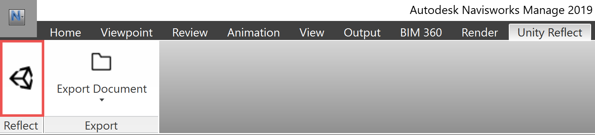

# The Reflect plugin for Navisworks

The Reflect plugin is available for the following versions of Navisworks:

* 2018
* 2019
* 2020
* 2021

## Installation

To install the plugin, run the [Reflect installer](../ReflectInstaller.md) and select your version or versions of Navisworks.

## Opening Reflect

From the **Unity Reflect** tab in Navisworks, click the Reflect icon.

  

## Exporting

The Navisworks plugin offers two options for exporting to Unity.

From the **Unity Reflect** tab in Navisworks, click **Export Document** and select either:

* **Export Document** to send the entire project to the Reflect server

* **Export Selection** to send selected items to the Reflect server

> **Note:** If you experience slow export speeds, this may be caused by a conflict with your antivirus software. This is a known issue.

## Syncing

Real-time syncing is not currently available due to the way Navisworks handles object IDs. This feature will be added in a future release of Unity Reflect.
