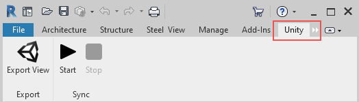
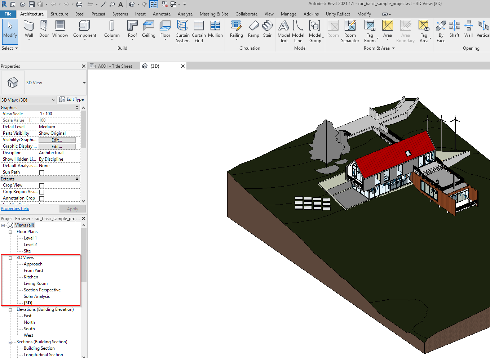
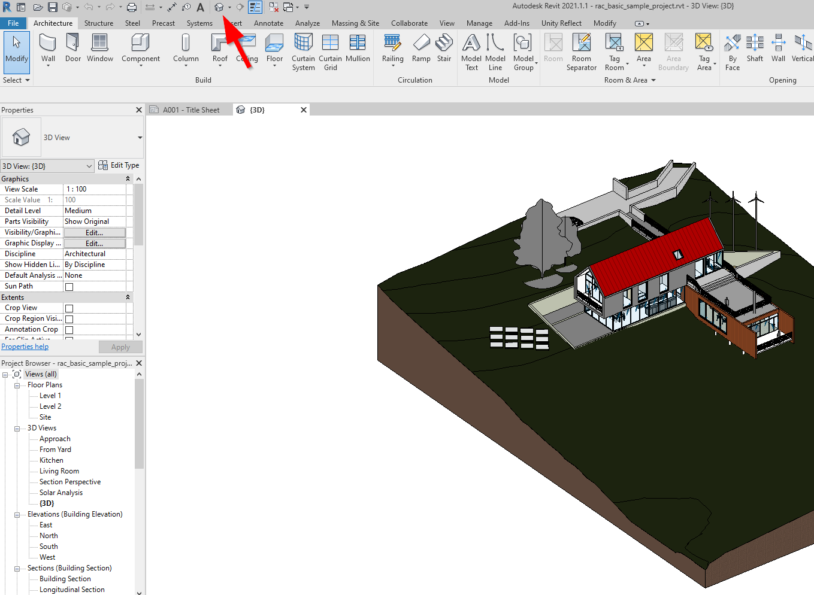

# The Reflect plugin for Revit

The Reflect plugin is available for the following versions of Revit:

* 2018*
* 2019
* 2020
* 2021

*Revit 2018 is still supported but is not maintained due to Autodesk’s policy of supporting only the most recent three versions.*

## Installation

To install the plugin, run the [Reflect installer](../ReflectInstaller.md) and select your version or versions of Revit.

Once the Revit plugin is installed on your computer, you can start the Reflect service from inside Revit to begin real-time syncing.

<!---**Create a Unity Project to sync with Reflect**

The beta version of Reflect requires you to create a Project from the Hub. Future versions  will allow you to create projects within Reflect.

1. Open the Unity Hub.
2. Click **Projects** and then click the drop-down arrow next to **New**.
3. Select version 2019.x (or later) and create your Project.--->

## Syncing

To start syncing Revit data with the Unity Editor:

1. Open Revit. If prompted to grant permissions to the Unity plugin, select **Load Once** (or **Always Load** to avoid future prompts).

2. Open the Revit project you want to sync with Reflect. If the Reflect plugin is installed, the ribbon includes a **Unity** tab:

   

3. Select a 3D view to publish with Reflect, either in the project browser or the default Revit 3D view.

  
  *Selecting a view in the project browser*

  
  *Selecting the default view*

4. Click **Start** to launch the Reflect service.

<!--
5. In the **Destination Project** field, select the Unity Project you just created.

6. Open the Reflect Viewer.

8. Click the folder icon  and open your Unity Project.

9. Click the sync icon  to begin real-time syncing. When this icon is green, syncing is active:

   

+ stop syncing, etc.

## Exporting

TO UPDATE
-->

[!include[SyncExport](../SyncExport.md)]
