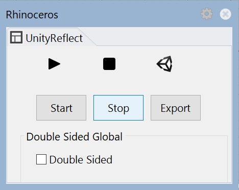

# The Reflect plugin for Rhino

The Reflect plugin supports Rhino 6.

## Installing the plugin

To install the plugin, run the [Reflect installer](../ReflectInstaller.md) and select **McNeel Rhino plugins**.

## Managing the plugin

To enable or disable the Reflect plugin in Rhino, run the command `PlugInManager` and locate Reflect in the list of available plugins.

### Showing the GUI

To open the Reflect plugin, run the Rhino command `ReflectGUI`.

Double-sided materials are disabled by default. To enable double-sided materials for every object in this scene, check **Double Sided.**
<!--* To enable double-sided materials for a specific object, select the object -->

[!include[SyncExport](../SyncExport.md)]
