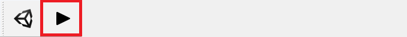
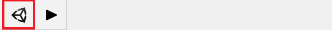

# The Reflect plugin for SketchUp

The Reflect plugin supports the following versions of SketchUp:

* 2019
* 2020

## Installing

To install the plugin, run the [Reflect installer](../ReflectInstaller.md) and select your version or versions of SketchUp.

## Syncing and exporting

## Syncing

To begin real-time syncing with Reflect, go to **Extensions** > **Unity** > **Sync** or click the toolbar button:

### Exporting

To export the current model to a Unity project, go to **Extensions** > **Unity** > **Export** or click the toolbar button:

[!include[SyncExport](../SyncExport.md)]
