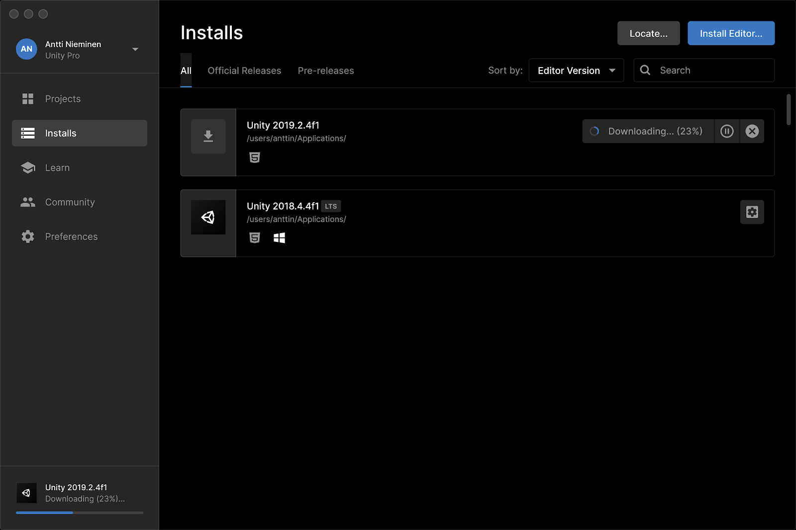
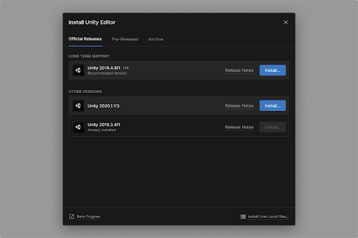
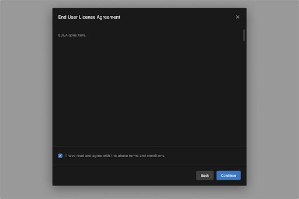
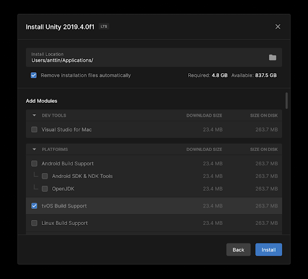

# Downloading and installing with the Unity Hub

With the Unity Hub, you can download and launch different versions of the Unity Editor as well as optional modules.

## Installing the Unity Editor

1. Open the Unity Hub and click **Installs** in the left sidebar.

2. Click **Install Editor**.

The pop-up window displays the available Unity releases.

* To download and install an official Unity release, select a version from the **Official Releases** tab.

* To install pre-releases or archived versions of Unity, click **Pre-Releases** or **Archive**.

* To install the Unity Editor from local files downloaded previously, click **Install from Local Files** in the lower right corner of the window.

3. Click **Install**.

If prompted, read and agree to the terms and conditions, then click **Continue**.

4. Select an install location and add any optional modules.

The Unity Hub can remove temporary installation files to free up disk space after installing the Editor. To enable this option, select **Remove installation files automatically**.

> Note: You can always add or remove modules later.

5. Click **Install**.
