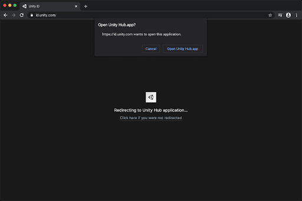

# Downloading and installing the Hub

## Installing the Hub

### To download the Unity Hub for Windows, macOS, or Linux:

1. Visit[ Download Unity](https://unity3d.com/get-unity/download) on the Unity website and follow the instructions on screen to download the installer.

2. Open the installer file, review the License Agreement, and click **I Agree.**

3. Choose the location where you want to install the Hub.

4. Click **Install.**

### Signing in to the Hub

1. Launch Unity Hub.

   

2. If you have a Unity ID, click **Sign In.** Unity Hub opens a sign-in page in your default web browser.

    If you do not have a Unity ID, click **Create Unity ID **and follow the prompts to create one. For more information about accounts and subscriptions, see [Unity Organizations](https://docs.unity3d.com/Manual/OrgsUnityOrganizations.html).

3. When you are successfully signed in, your web browser redirects you back to the Unity Hub. (If prompted, click **Open Unity Hub.app.**)

   

### Uninstalling the Hub

<!--Need this info. (For PC, was only able to find CLI instructions. Should I send them to Add and Remove Programs?  What about on Mac/Linux?)-->

### Updating the Hub

<!--Need this info too: couldn’t locate in UI previews.-->
