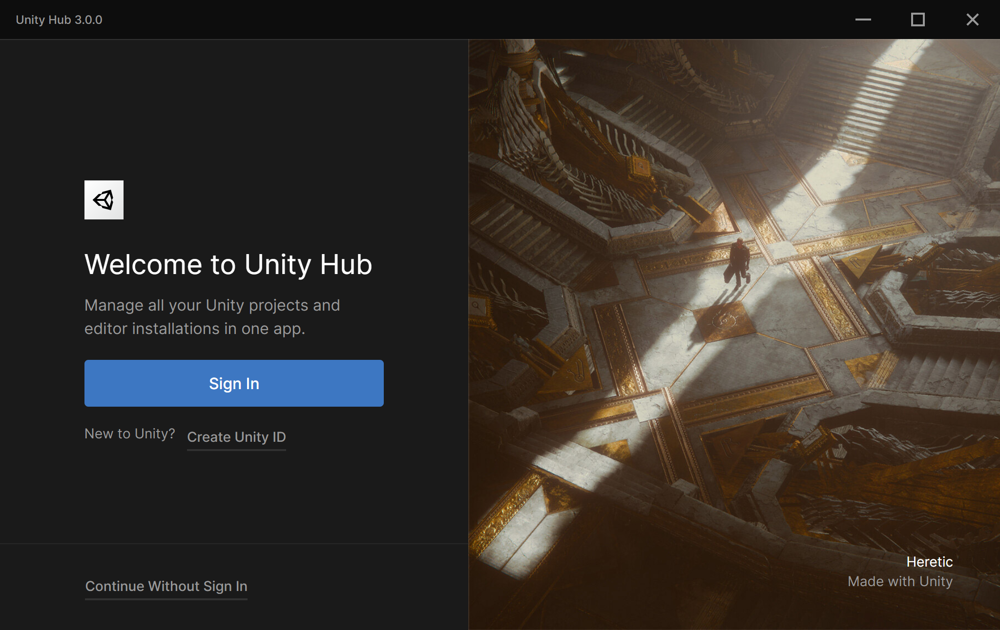

# Signing in to the Hub

1. Launch Unity Hub.

   

2. If you have a Unity ID, click **Sign In.** Unity Hub opens a sign-in page in your default web browser.

    If you do not have a Unity ID, click **Create Unity ID **and follow the prompts to create one. For more information about accounts and subscriptions, see[ Unity Organizations](https://docs.unity3d.com/Manual/OrgsUnityOrganizations.html).

3. When you are successfully signed in, your web browser redirects you back to the Unity Hub. (If prompted, click **Open Unity Hub.app.**)

   
