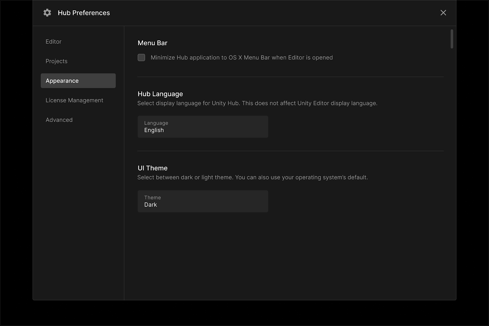
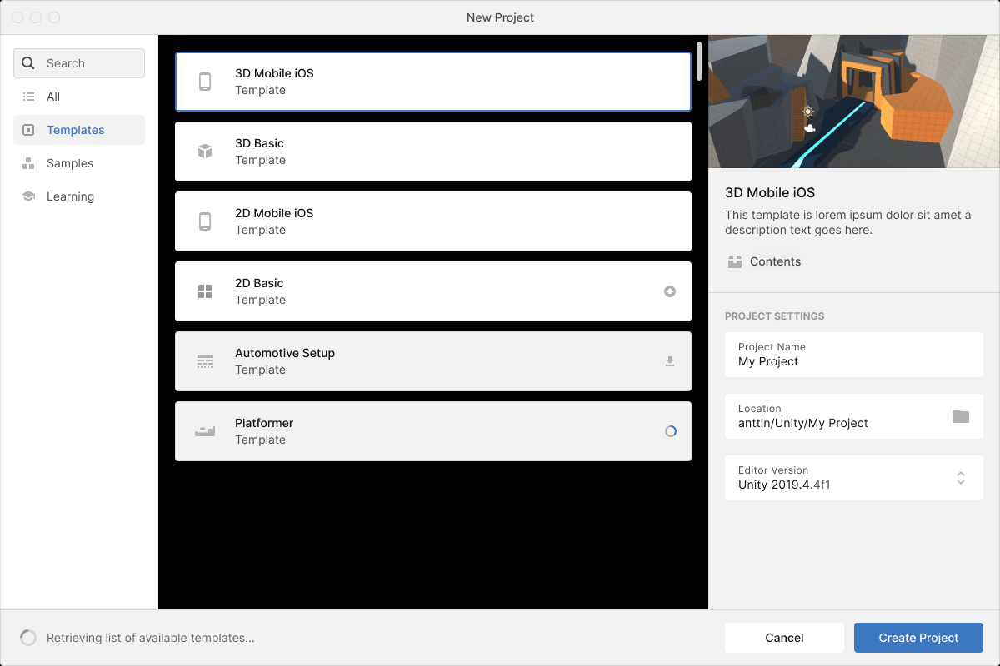
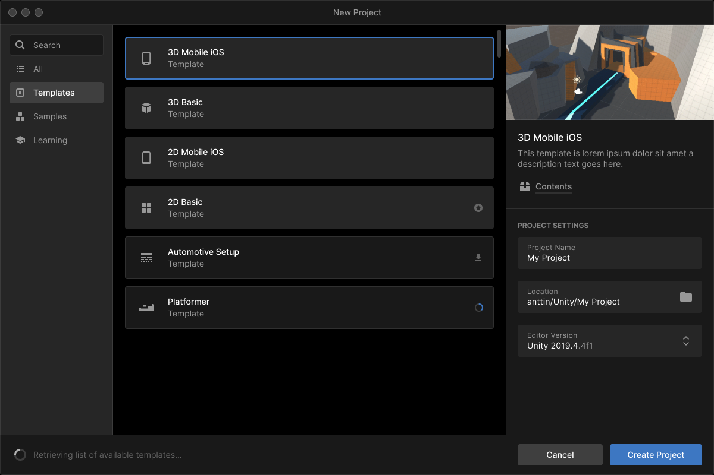

# Change your Hub preferences

The Preferences screen lets you customize a wide range of preferences. To switch between Preferences screens, use the left-hand navigation menu.

* **Editor** lets you specify the folders on your computer where the Unity Hub downloads and installs the Unity Editor. For more information about Editor downloads, see [link](#).

* **Projects** lets you specify the folder where new projects are created. For more information about creating projects, see [link](#).

* **Appearance** lets you specify the Unity Hub display language, UI theme, and other appearance settings. For more information, see [Select a theme](#).

* **License Management** lets you manage and activate your Unity licenses. For more information about managing your licenses, see [link](#).

* **Advanced** lets you opt in or out of automatically downloading beta releases. For more information about beta releases, see [link](#).

## Select a theme

To change the display theme of the interface, go to **Preferences** > **Appearance**.

Under the heading **UI Theme**, select one of the options from the drop-down menu.

*Light theme*

*Dark theme*
