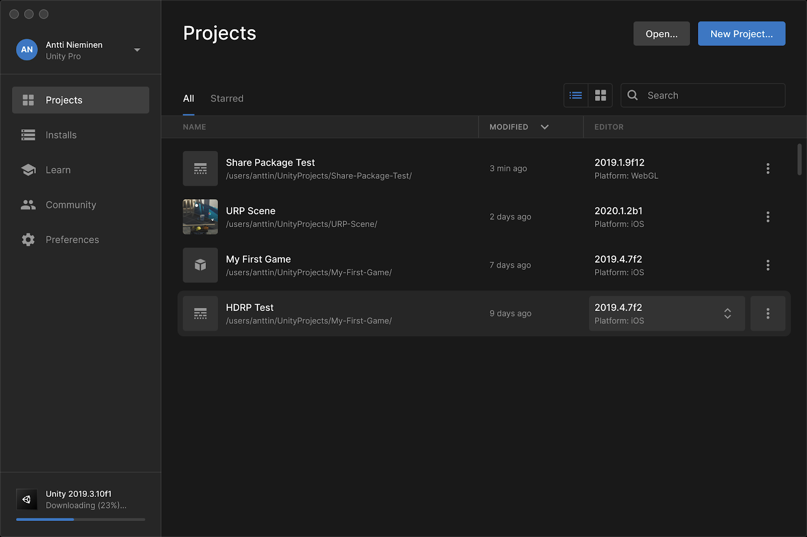
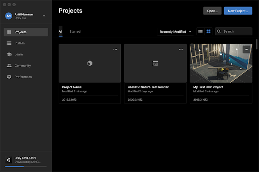
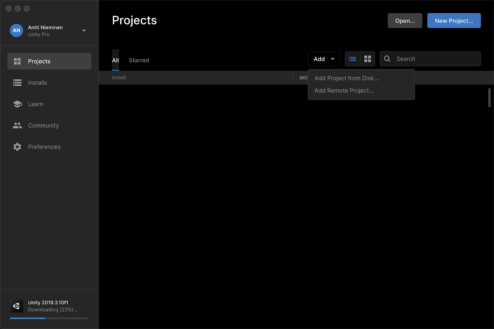
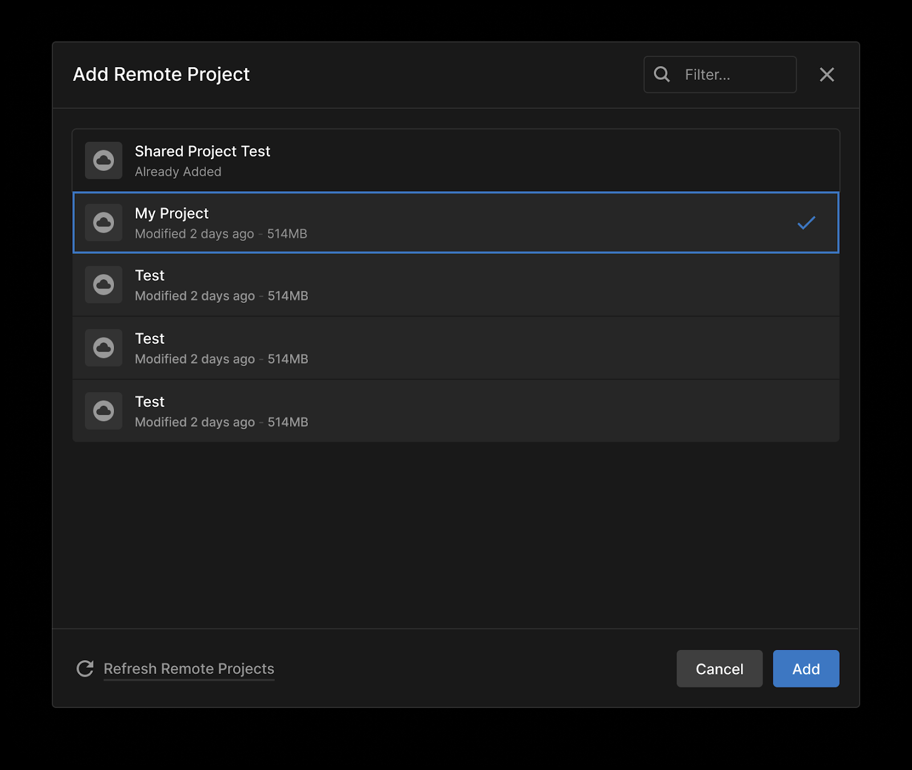
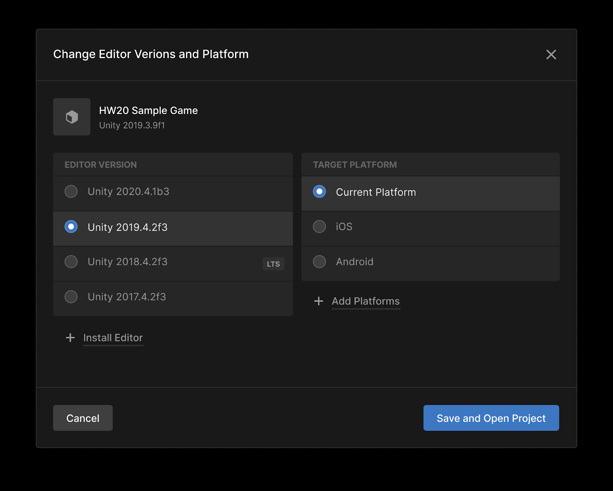
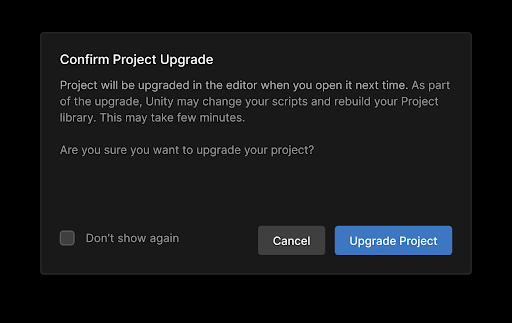
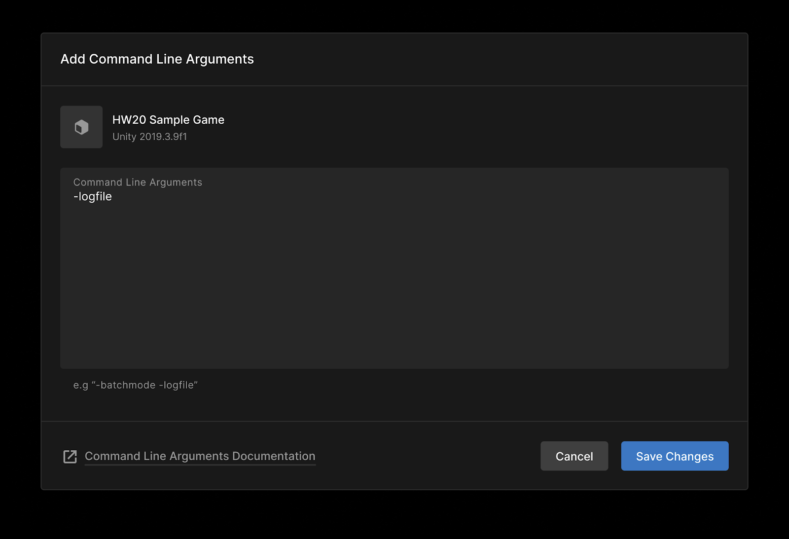
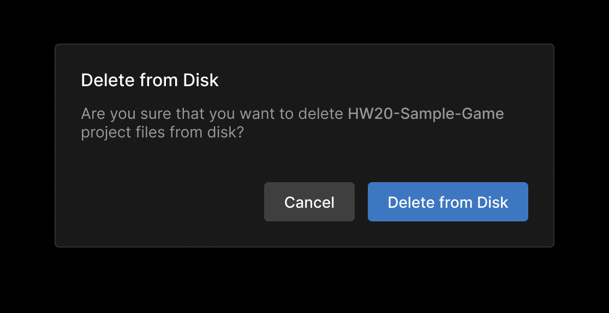

# Projects

## Overview

The **Projects** screen displays your Unity Projects. From this screen you can create a new Project, manage your existing Projects, or open a Project in the Unity Editor.

### Switching between list and grid view

By default, the your Projects are displayed in a list. You can also display your Projects in a grid view. Either view allows you to sort, search, and manage your Projects.

To switch to grid view, click [grid icon].

To switch back to list view, click [list icon].

## Managing your Projects

To view your Unity Projects in the Hub, click the **Projects** tab.

### Adding an existing Project

If you have an existing Project that isn’t displayed on the Projects screen, click **Add**.

* To add a local Project, click **Add Project from Disk** and browse to the Project folder. You can also drag and drop the folder from your filesystem directly into the Projects screen.

* To add a project from the cloud, including collab projects, click **Add Remote Project.**

Locate the remote project and click **Add.**

To remove or delete a project, see [Removing or deleting a project](#).

### Configuring a Project

From the Projects screen, click  next to the Project name. This opens a drop-down menu with additional options.

    > **Note:** In grid view, open this menu by clicking **...** inside a project tile.

### Starring a Project

To star a Project for quick access, click **Add to Starred** from the drop-down menu.

To see all your starred Projects on the Projects screen, click **Starred**.

### Changing Editor version or target platform

To change the Editor version or target platform associated with a Project, click the Editor version and select from the available options, then click **Save and Open Project**.

Click **Upgrade Project** to confirm that you want to upgrade or downgrade your project.

### Locating Project files on your hard drive

From the drop-down menu, click **Reveal in Finder** from the drop-down menu.

### Adding command line arguments

If you want to launch your Project with command line arguments, click **Add Command Line Arguments… **to open a text box.

Enter your arguments and click **Save Changes**.

For more information about the available arguments, see [link](#).

### Removing or deleting a Project

To remove a Project from the Hub without deleting local files, click **Remove from List. **You can add the Project folder again at any time by [Adding an existing Project to the Hub](#).

To delete local Project files, click **Delete from Disk… **in the drop-down menu. When prompted, click **Delete from Disk** to confirm your selection.

This removes all Project files from your hard drive.
