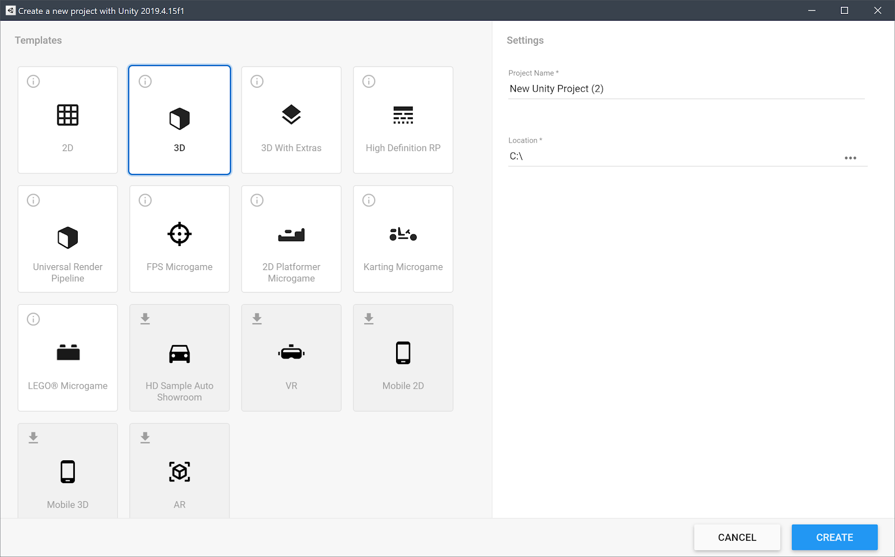
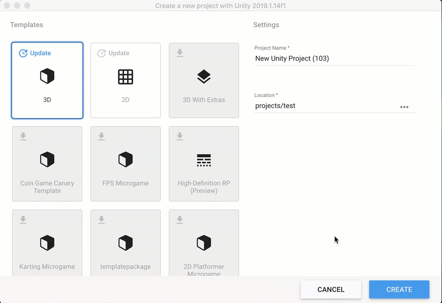

# Templates

When you create a Project, you select a Template with which to initialize your Project.

## Overview of Templates

All versions of Unity offer **Core Templates**. These are blank templates with preloaded packages and settings that enable you to quickly create a Project. (For example: 2D, 3D, 3D with Extras.) For information about the current Core Templates, see [Core Templates].

LTS versions of Unity also offer:

*   **Sample Templates:** Content-based templates designed to demonstrate Editor capabilities for a specific outcome. (For example: HDRP, Auto Showroom.)

*   **Learning Templates:** Project-led templates designed to teach you to use Unity features or builds and to publish a Project for a specific outcome. (For example: FPS Microgame, 2D Platformer Microgame, Karting Microgame, LEGO® Microgame.)

_LTS Project Templates_

Because Templates are not shared between Editor versions, you need to download them separately for each version of the Editor you install. You must be connected to the Internet to see or download the latest Templates.

### Core Templates

#### 2D

Configures Project settings for 2D apps that use Unity’s [built-in rendering pipeline](https://docs.unity3d.com/Manual/SL-RenderPipeline.html).

#### 3D

Configures Project settings for 3D apps that use Unity’s [built-in rendering pipeline](https://docs.unity3d.com/Manual/SL-RenderPipeline.html).

#### 3D with Extras

Configures Project settings for 3D apps that use Unity’s built-in renderer and [post-processing features](https://github.com/Unity-Technologies/PostProcessing/wiki). This Project type uses the new post-processing stack and includes several [Presets](https://docs.unity3d.com/Manual/Presets.html) to jump-start development along with example content.

### Sample templates

#### High Definition RP

Available as a sample template from Editor version 2020.2.X onward, this template uses the High Definition Render Pipeline (HDRP) for graphics-intensive projects on platforms that support Shader Model 5.0 (DX11 and above).

This project includes:

*	Shader Graph: a tool that allows you to create shaders using a visual node editor instead of writing code. For more information on Shader Graph, see the [Shader Graph documentation](https://docs.unity3d.com/Packages/com.unity.shadergraph@latest).

*	Visual Effect Graph

*	Presets

*	Example content

#### Universal Render Pipeline

The Universal Render Pipeline Template configures Project settings for Projects where performance, wide platform support, and ease of customizing graphics are the primary considerations.
This Template uses the following Unity features:
* Universal Render Pipeline (URP): a prebuilt Scriptable Render Pipeline that is quick and easy to customize, and lets you create optimized graphics across a wide range of platforms. URP also includes an optimized 2D renderer complete with 2D lights and pixel
 perfect rendering, and an integrated post-processing solution. For more information on URP, see the URP documentation.
* Shader Graph: a tool that allows you to create shaders using a visual node editor instead of writing code. For more information on Shader Graph, see the Shader Graph documentation.
The template contains the following:
* A sample Scene that contains examples of how to configure lighting settings, Materials, Shaders, and post-processing effects in URP
* Several preconfigured Universal Render Pipline Assets that let you quickly swap between graphics quality levels
* Presets that have been optimized for use with URP

### Learning Templates

#### 2D Platformer Microgame

#### Karting Microgame

#### LEGO® Microgame

## Downloading Dynamic Templates

In the Unity Hub, when you click **New**, the Templates window displays a list of all the Project Templates available for that version of the Editor.

If a Dynamic Template is available for download, its tile displays a download icon.

To download a Template, move your cursor over its tile and click **Download**. When prompted, click **Install**.

## Updating Dynamic Templates

If an update is available for a Template you previously installed, its tile displays the option **Update**. You can either download the update or continue using the installed version of the Template.

_Downloading and updating Dynamic Templates_

## Creating a project from a Template

To create a new Project (and specify which Editor version to open it in), do one of the following:

*   Click the **New** button. The title bar of the New Project dialog box displays the Editor version that the project will use.
*   Click the drop-down arrow next to the **New** button to select the Editor version that you want to use.

    **Note**: This drop-down menu is only available if you have installed multiple versions of the Editor in the Hub.

Select a Template, Project Name, and Location:

<table>
  <tr>
   <td><strong>Setting</strong>
   </td>
   <td><strong>Function</strong>
   </td>
  </tr>
  <tr>
   <td>Templates
   </td>
   <td>Choose a Project Template.

For information about a specific Template, click the 🛈 icon.
   </td>
  </tr>
  <tr>
   <td>Project Name
   </td>
   <td>Sets the name of your Project. This names the main Project folder, which stores the Assets,<strong> Scenes,</strong> and other files related to your Project.
   </td>
  </tr>
  <tr>
   <td>Location
   </td>
   <td>Use this to define where in your computer’s file system to store your Project. The location of your Project defaults to the home folder on your computer. To change it, type the file path to your preferred storage location in the Location field. Alternatively, click the ellipsis icon (…) in the Location field. This opens your computer’s file browser (Explorer, Finder or Files, depending on your computer’s operating system). In your file browser, navigate to the folder that you want to store your Project in and click Select Folder or Open.
   </td>
  </tr>
</table>

When you’re satisfied with the Project settings, click **Create.**
